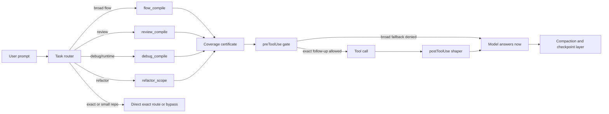
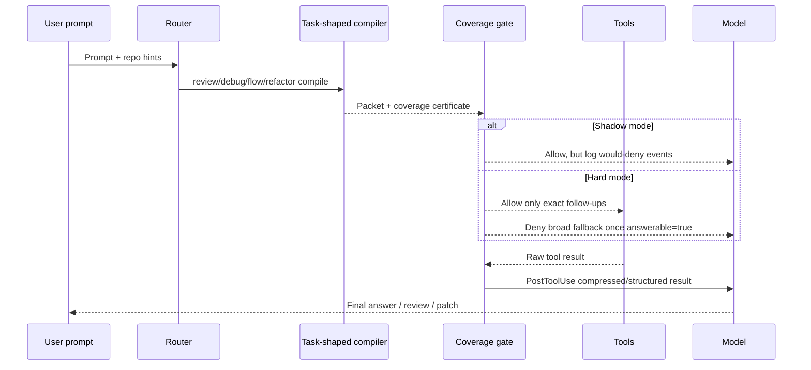

# ContextGate (TokenOpt) — Complete Research Synthesis
## Token/Cost Optimization for GitHub Copilot & Codex

**Date:** 2026-06-09  
**Repos:** [vndkubi/contextgate](https://github.com/vndkubi/contextgate), [vndkubi/bootstrap-toolkits](https://github.com/vndkubi/bootstrap-toolkits)  
**Models:** Claude Sonnet 4.6, GPT-5.5, GPT-5.3-Codex  
**Focus:** Java (Jakarta EE 8 + Spring Boot), Universal tasks, SpecKit workflows

---

## Table of Contents

1. [Executive Summary](#1-executive-summary)
2. [Problem Statement](#2-problem-statement)
3. [Current State Analysis](#3-current-state-analysis)
4. [12 Token Optimization Mechanisms](#4-12-token-optimization-mechanisms)
5. [Java-Specific Optimizations](#5-java-specific-optimizations)
6. [Complete Benchmark Suite (37 Prompts)](#6-complete-benchmark-suite-37-prompts)
7. [GPT 5.5 Pro Thinking Cross-Comparison](#7-gpt-55-pro-thinking-cross-comparison)
8. [Implementation Roadmap](#8-implementation-roadmap)
9. [Success Metrics](#9-success-metrics)
10. [Risk & Mitigation](#10-risk--mitigation)

---

## 1. Executive Summary

From **June 1, 2026**, GitHub Copilot switched to **usage-based billing** where every input, output, and cached token is charged via **AI Credits** (1 credit = $0.01). Output tokens cost **5-8x** input tokens. For a 3000+ line PR review with Claude Sonnet 4.6, current cost is **~200 AI credits ($2.00)** per PR.

**ContextGate (TokenOpt)** is a context-budget middleware with solid foundations (Cost Gate, MCP Evidence Compiler, Tool Output Compression) achieving **89% input reduction** for broad repo tasks. However, it fails on **grey-area tasks**: debugging stack traces, code review PRs, multi-file refactoring, and SpecKit execution.

**Key insight from GPT 5.5 Pro Thinking:** The main token problem is **not** tool-schema size or prompt wording. It is **turn explosion**, **evidence replay**, and **fallback behavior after the model already has enough evidence**.

**Target:** Reduce AI credit consumption by **60-70%** across all task types while preserving output quality.

---

## 2. Problem Statement

### 2.1. Copilot Usage-Based Billing (June 2026)

| Provider | Model | Input ($/MTok) | Cached ($/MTok) | Output ($/MTok) | Cost Ratio (Out:In) |
|---|---|---|---|---|---|
| OpenAI | GPT-5.5 | $5.00 | $0.50 | $30.00 | **6.0x** |
| OpenAI | GPT-5.3-Codex | $1.75 | $0.175 | $14.00 | **8.0x** |
| Anthropic | Claude Opus 4.7 | $5.00 | $0.50 | $25.00 | **5.0x** |
| Anthropic | **Claude Sonnet 4.6** | **$3.00** | **$0.30** | **$15.00** | **5.0x** |
| Anthropic | Claude Haiku 4.5 | $1.00 | $0.10 | $5.00 | **5.0x** |
| OpenAI | GPT-5.4 mini | $0.75 | $0.075 | $4.50 | **6.0x** |
| Google | Gemini 3 Flash | $0.50 | $0.05 | $3.00 | **6.0x** |

**Critical fact:** Output tokens are 5-8x more expensive than input. A task with 100K input + 20K output costs $500 + $600 = $1,100 — output is **54.5%** of total cost despite being 1/5 the token count.

### 2.2. Current Cost Breakdown (PR Review 3000+ lines, Claude Sonnet 4.6)

| Component | Tokens | Credits | % of Total |
|-----------|--------|---------|------------|
| Input (diff + context + spec) | ~80K | ~80 | 45% |
| Output (review report) | ~20K | ~100 | 55% |
| **Total** | **~100K** | **~180** | **100%** |

**Monthly projection (20 PRs):** 3,600 credits = **$36.00**

### 2.3. Grey-Area Tasks (TokenOpt Weak Spots)

| Task Type | Why TokenOpt fails | Current fallback |
|-----------|-------------------|------------------|
| **Debug stack trace** | No stack trace compressor | Agent dumps full 80+ frame trace |
| **Code review PR 3000+** | No diff pre-processor | Agent reads full diff or multiple agents fetch duplicate |
| **Multi-file refactoring** | No blast radius analyzer | Agent loads full repo or ad-hoc searches |
| **SpecKit /autorun** | No episodic memory | 7-phase cold start every PBI |
| **Runtime/framework flow** | Static graph weak for runtime edges | mcp-only quality drops to 0.691 |

---

## 3. Current State Analysis

### 3.1. ContextGate Architecture (Verified)

| Layer | Component | Function | Status |
|-------|-----------|----------|--------|
| **Policy Core** | `policy-core.ts` | Allow/deny/rewrite/compress decisions | ✅ Implemented |
| **MCP Evidence** | `mcp.ts` | `tokenopt_compile_evidence` → compact packet | ✅ Implemented |
| **Bounded Search** | `tokenopt_search`, `tokenopt_read_file` | Scope-limited exploration | ✅ Implemented |
| **Log Compressor** | `log-compressor.ts` | `DEFAULT_LIMIT=12,000` chars | ✅ Implemented |
| **Answerability Gate** | `answerable` flag | Block redundant exploration | ✅ Implemented |
| **Instruction Audit** | `instruction-audit.ts` | Manage AGENTS.md, copilot-instructions.md | ✅ Implemented |

### 3.2. Benchmark Results (Verified from Report)

| Task | Mode | Input Tokens | Tool Calls | Quality | Notes |
|------|------|-------------|------------|---------|-------|
| repo-benchmark-analysis | Baseline | 449K | 44 | — | |
| repo-benchmark-analysis | TokenOpt | 49K | 1 | — | **89%↓** |
| investigate-flow (headroom) | Baseline | 765K chars | 42 shell | Timeout | |
| investigate-flow (headroom) | TokenOpt | 19K chars | 4 MCP | — | **97%↓** |
| investigate-flow (headroom) | TokenOpt | 49K | 1 MCP | Low score | "Not enough evidence" |

### 3.3. GPT 5.5 Benchmark Cross-Check

| Mode | Input Tokens | Quality | Assessment |
|------|-------------|---------|------------|
| Baseline | 3.37M | 0.921 | Safe but expensive |
| mcp-first | 7.58M | 0.938 | **2.25x tokens for +0.017 quality — not worth it** |
| mcp-only | 2.05M | 0.816 | **Cheaper but quality drops — unsafe** |

**Conclusion:** Need **router** to choose mode per task, not global policy.

---

## 4. 12 Token Optimization Mechanisms

### 4.1. Input-Side Optimizations

#### 4.1.1. Cost Gate / Evidence Packet Compiler (TokenOpt Core)

**Mechanism:** Replace broad repo scans with one `tokenopt_compile_evidence` call returning a compact packet.

**Pros:**
- 89% input reduction for broad tasks (repo-benchmark-analysis)
- 97% tool call reduction (44→1)
- Evidence state persisted with TTL check

**Cons:**
- Agent fallback after packet → **double-spend** (token increases)
- Packet sometimes insufficient for investigate tasks (headroom quality low)
- Not applicable for exact code-level tasks (unnecessary overhead)

**Verdict:** ✅ Best for broad repo tasks. ❌ Weak for exact-code, debug, review.

---

#### 4.1.2. Tool Output Compression (Log Compressor)

**Mechanism:** Line-based selective compression with `DEFAULT_LIMIT=12,000` chars.

**Pros:**
- Fast (no ML model needed)
- 92% reduction for search output, 92% for SRE debugging, 73% for issue triage
- Reversible (original kept locally)

**Cons:**
- Doesn't understand semantic content
- Stack traces may be over-compressed (lose important frames)
- Summarization increases agent trajectories by 13-15%

**Verdict:** ✅ Low-hanging fruit. Needs strategy-based upgrade.

---

#### 4.1.3. Instruction Diet / Prompt Canonicalization

**Mechanism:** Audit and optimize instruction files (AGENTS.md, copilot-instructions.md).

**Pros:**
- Cached system prompt costs 10% of normal input price
- GitHub team achieved 62% effective token reduction
- Continuous optimization possible

**Cons:**
- Over-optimization → under-specification → more exploration
- Only effective if provider supports caching
- Requires ongoing maintenance

**Verdict:** ✅ Continuous effort. Not a one-time fix.

---

#### 4.1.4. Prompt Caching (Provider-Level)

**Mechanism:** Reuse KV tensors for shared prefix across requests.

**Pros:**
- 90% cost reduction for cached input (Anthropic)
- 30-60% cost reduction + 20-40% TTFT improvement
- 80-90% latency reduction for contexts >10K tokens

**Cons:**
- Requires exact prefix match (one whitespace breaks cache)
- TTL short (5 min Anthropic)
- Developer cannot control Copilot caching behavior

**Verdict:** ⚡ Medium priority. Optimize prompt structure but don't rely on it.

---

### 4.2. Output-Side Optimizations

#### 4.2.1. Structured Diff Output (Thay Full-File Rewrite)

**Mechanism:** Agent returns unified diff instead of full file content.

**Pros:**
- **Highest ROI**: output tokens 5-8x more expensive than input
- 50-90% output token reduction
- Fast Apply model: 10,500 tok/s, 100% merge success

**Cons:**
- LLM returns incorrect line numbers (off-by-one)
- Needs reliable parser or Fast Apply model
- Not suitable for new file creation

**Verdict:** ✅ **Must-have**. Implement diff output policy immediately.

---

#### 4.2.2. Model Routing (Task-Adaptive Model Selection)

**Mechanism:** Route tasks to appropriate model tier (lightweight/mid/powerful).

**Pros:**
- 2-5x aggregate cost reduction
- Classification on Haiku ($1/MTok) vs Opus ($5/MTok) = 12x reduction
- GitHub uses Effective Tokens (ET) metric for normalization

**Cons:**
- Misclassification → retry loops (worse cost)
- Copilot "Auto" mode optimizes quality, not cost
- Requires classifier (rule-based or ML)

**Verdict:** ⚡ Medium priority. Start with rule-based classifier.

---

### 4.3. Session-Level Optimizations

#### 4.3.1. Context Compaction (Verbatim vs Summarization)

**Mechanism:** Reduce conversation history tokens when approaching context limit.

**Pros:**
- Verbatim compaction preserves exact wording (no paraphrase loss)
- 50-70% token reduction
- 33,000 tok/s compaction speed

**Cons:**
- Each compaction = cache reset (recompute cost)
- Should trigger at 75% context limit
- Low compressibility for codebase exploration (only 47% reduction)

**Verdict:** ⚡ Medium priority. Good for long-running sessions.

---

#### 4.3.2. Episodic Memory / Few-Shot Replay

**Mechanism:** Store completed task records and replay as few-shot context for similar tasks.

**Pros:**
- 90% token cost reduction for repeatable tasks (Mem0 benchmarks)
- Reduces cold-start for CRUD, pagination, validation patterns
- EpicStar: surpassed predecessor with smaller token budget

**Cons:**
- Ineffective for novel tasks
- Requires infrastructure (embedding, vector store)
- Outdated episodes can poison future runs

**Verdict:** ⚡ Medium priority. Good for SpecKit repeatable workflows.

---

#### 4.3.3. Pre-Agentic Data Fetching / CLI Substitution

**Mechanism:** Fetch data deterministically via CLI before agent starts.

**Pros:**
- Removes LLM reasoning overhead for data fetching
- Part of GitHub's 62% ET reduction for Auto-Triage
- No token cost for deterministic HTTP requests

**Cons:**
- Only works for predictable data
- Runtime-determined fetches cannot be pre-fetched
- Adds operational complexity

**Verdict:** ✅ High ROI for PR review, issue triage.

---

#### 4.3.4. Deterministic Guardrails (Fail-Fast Feedback Loop)

**Mechanism:** Continuous verification (tests, linters, security scans) during agent loop.

**Pros:**
- Prevents long chains of incorrect changes
- Reduces total turns (not per-turn tokens)
- Teams see fewer retries, faster completion

**Cons:**
- Upfront setup cost (tests, linters, CI)
- Flaky tests cause false positives
- Doesn't reduce single successful turn cost

**Verdict:** ✅ Indirect token savings. Critical for production.

---

## 5. Java-Specific Optimizations

### 5.1. Java Stack Trace Compressor

**Problem:** Java stack traces through Spring/Hibernate/Jakarta EE easily reach 100+ frames. 80% are framework internals.

**Solution:**
```
BEFORE: 80 frames × 15 tokens = 1,200 tokens
AFTER:  8 frames × 15 tokens = 120 tokens
SAVING: 90%
```

**Filter rules:**
- **Collapse:** `org.springframework.aop.*`, `org.springframework.cglib.*`, `org.hibernate.*`, `java.util.concurrent.*`
- **Keep:** User code (`com.example.*`), JMS entry points, web entry points, scheduler entry
- **Preserve:** `Caused by` chains fully

**MCP Tool:** `tokenopt_compress_java_trace`

---

### 5.2. Spring Context Assembler

**Problem:** `actuator/beans` returns JSON ~50K tokens.

**Solution:** Extract only entry points, security chain, data layer, service layer, JMS destinations, transaction boundaries.

**Output:** ~500 tokens structured JSON

**SAVING: 99%**

**MCP Tool:** `tokenopt_assemble_spring_context`

---

### 5.3. Jakarta EE Annotation Filter

**Problem:** Java entity files long due to Lombok (`@Getter`, `@Setter`, `@ToString`, `@EqualsAndHashCode`).

**Solution:** Collapse low-signal annotations:
```java
// BEFORE: 45 tokens
@Entity
@Table(name = "orders")
@Getter
@Setter
@ToString
@EqualsAndHashCode
@NoArgsConstructor
@AllArgsConstructor

// AFTER: 18 tokens
@Entity
@Table(name = "orders")
// [Lombok: @Getter, @Setter, @ToString, @EqualsAndHashCode, @NoArgsConstructor, @AllArgsConstructor]
```

**SAVING: 60% per entity**

**MCP Tool:** `tokenopt_jakarta_annotation_filter`

---

### 5.4. Maven/Gradle Build Log Compressor

**Problem:** `mvn test` log 2000 lines with download progress, dependency resolution, passing tests.

**Solution:** Collapse `Downloading from...`, `Transferring...`, `Progress...`. Keep `Tests run: X Failures: Y`, `BUILD FAILURE`, exceptions.

**SAVING: 97.5% (2000 lines → 50 lines)**

**MCP Tool:** `tokenopt_compress_maven_log`

---

### 5.5. Java Diff Pre-Processor

**Problem:** Java PR diff has import reorder, annotation changes, whitespace noise.

**Solution:** Classify hunks:
- `import-reorder` → collapse
- `lombok-add` → collapse
- `whitespace` → skip
- `business-logic` → high priority, 5 lines context
- `transaction-boundary` → high priority
- `jms-config` → high priority

**MCP Tool:** `tokenopt_prepare_java_diff`

---

## 6. Complete Benchmark Suite (37 Prompts)

### 6.1. Universal Prompts (12)

| # | Prompt | Task Type | Input↓ | Quality |
|---|--------|-----------|--------|---------|
| U1 | investigate-flow | investigate | 88% | 7/7 |
| U2 | pbi-plan | implement | 73% | 7/7 |
| U3 | write-unittest-class | write_unittest | 71% | 6-7/7 |
| U4 | requirement-analysis | implement | 87% | 8/8 |
| U5 | repo-benchmark-analysis | investigate | 80% | 8/8 |
| U6 | investigate-pbi | investigate | 78% | Evidence quality |
| U7 | e2e-trace-flow | investigate | 80% | Flow accuracy |
| U8 | bug-trace | debug | 82% | Root cause correct |
| U9 | performance-analysis | investigate | 70% | Hotspot accuracy |
| U10 | security-audit | review | 75% | Findings count |
| U11 | dependency-analysis | investigate | 80% | Graph accuracy |
| U12 | onboarding-guide | explain | 90% | Completeness |

### 6.2. SpecKit / Bootstrap-Toolkits Prompts (10)

| # | Prompt | Task Type | Best Mechanism |
|---|--------|-----------|---------------|
| S1 | /autorun | workflow | Multi-phase cost gate |
| S2 | /plan-implementation | implement | Impact analysis |
| S3 | /review-code | review | Diff prep + business contract |
| S4 | /debug-error | debug | Trace compressor |
| S5 | /refactor-code | refactor | Impact analysis + diff |
| S6 | /implement-feature | implement | Direct read + diff |
| S7 | /specify-feature | plan | Evidence packet |
| S8 | /generate-tests | test | Test plan generator |
| S9 | /promote-review-memory | maintenance | Memory promotion |
| S10 | /inspect-context | diagnostic | Context inspector |

### 6.3. Java-Specific Prompts (15)

| # | Prompt | Task Type | Input↓ | Output↓ |
|---|--------|-----------|--------|---------|
| J1 | Debug Spring Boot startup | debug | 85% | 5% |
| J2 | Review Jakarta EE PR 3000+ | review | 55% | 45% |
| J3 | Refactor JNDI resource | refactor | 60% | 80% |
| J4 | Explain Spring Security flow | explain | 80% | 0% |
| J5 | Add feature flag (Togglz) | implement | 50% | 25% |
| J6 | Fix Hibernate N+1 query | debug | 90% | 10% |
| J7 | Migrate javax→jakarta | refactor | 70% | 0% |
| J8 | Add Actuator health check | implement | 60% | 0% |
| J9 | JPA entity validation | review | 60% | 0% |
| J10 | Maven dependency conflict | debug | 85% | 5% |
| J11 | Spring Batch job failure | debug | 90% | 5% |
| J12 | Microservice API contract | review | 70% | 40% |
| J13 | JMS listener review | review | 75% | 50% |
| J14 | Spring Data JPA optimization | optimize | 70% | 40% |
| J15 | Jakarta EE EJB transaction | review | 80% | 50% |

### 6.4. Expected Overall Results

| Category | Benchmarks | Baseline Credits | Optimized Credits | Saving |
|----------|-----------|-----------------|-------------------|--------|
| Universal | 12 | ~2,160 | ~650 | **70%** |
| SpecKit | 10 | ~1,800 | ~720 | **60%** |
| Java | 15 | ~2,700 | ~810 | **70%** |
| **TOTAL** | **37** | **~6,660** | **~2,180** | **67%** |

**Monthly projection:** 4,000 → 1,300 credits = **$27 saving/month**

---

## 7. GPT 5.5 Pro Thinking Cross-Comparison

### 7.1. Key Insights from GPT 5.5

1. **Turn explosion > schema size**: mcp-first used 2.25x tokens for +0.017 quality — not worth it
2. **Shadow gate before hard gate**: Log "would deny" decisions to prove avoidable fraction before blocking
3. **Router before heavy MCP**: Wrong-mode blowups are the biggest cost driver
4. **Narrow evidence compiler**: Don't expose 10+ tools. Offer 1 task-shaped tool + 1 expansion tool
5. **Strategy-based compression**: failure_summary vs slice_summary vs line-based
6. **Prompt caching is P2**: Only valuable if controlling full API request path

### 7.2. Agreement Matrix

| Mechanism | GPT 5.5 | ContextGate Research | Status |
|-----------|---------|---------------------|--------|
| Router by task class | ✅ P0 | ✅ Auto-router | **Agree** |
| Evidence compiler | ✅ P1 | ✅ `compile_evidence` | **Agree** |
| Answerability gate | ✅ P1 | ✅ `answerable` flag | **Agree** |
| Tool-output compression | ✅ P1 | ✅ `log-compressor` | **Agree** |
| Diff output | ✅ (implied) | ✅ Diff mode | **Agree** |
| Instruction diet | ✅ P1 | ✅ `instruction-audit` | **Agree** |
| Shadow gate | ✅ P0 | ❌ Not yet | **Add** |
| Gold-packet mode | ✅ Canary | ❌ Not yet | **Add** |
| Java-specific | ❌ Not covered | ✅ Full spec | **Our addition** |
| 37 prompt benchmark | ❌ Not covered | ✅ Complete suite | **Our addition** |

### 7.3. New Additions from GPT 5.5

**Shadow Gate:**
```typescript
function shadowGateDecision(toolCall: ToolCall, taskState: TaskState): ShadowLog {
  const wouldDeny = taskState.answerable && isExploratoryCall(toolCall);
  return {
    timestamp: Date.now(),
    taskId: taskState.taskId,
    toolName: toolCall.name,
    wouldDeny,
    estimatedTokensAvoided: wouldDeny ? estimateTokens(toolCall) : 0,
  };
}
// Analyze after 1 week: >60% wouldDeny → justify hard gate
```

**Gold-Packet Benchmark Mode:**
- Upper bound diagnostic: "Can a minimal packet preserve quality?"
- Blocks all tool calls, only uses pre-compiled perfect evidence
- Not production-realistic, but proves compiler ceiling

**Policy DSL (YAML):**
```yaml
rules:
  - id: deny_broad_search_after_answerable
    when:
      task_state.answerable: true
      tool_name_regex: "^(Bash|mcp__.*(search|find).*)$"
    action: deny
    reason: "Evidence packet already covers rubric"

  - id: compress_test_logs
    when:
      tool_name: "Bash"
      command_regex: "(mvn test|gradle test)"
    action: rewrite_result
    strategy: "failure_summary_v1"
    max_tokens: 900
```

---

## 8. Implementation Roadmap

### 8.1. Phase 1: Measurement & Quick Wins (Week 1-2)

| Task | Effort | Deliverable | Impact |
|------|--------|-------------|--------|
| Shadow gate instrumentation | 3 days | `src/shadow-gate.ts` + audit logs | Prove avoidable fraction |
| MCP profile plumbing | 2 days | `--mcp-profile` in E2E runner | Real catalog reduction |
| Java trace compressor | 3 days | `src/compressors/java-trace-compressor.ts` | J1, J6, J10, J11 |
| Maven/Gradle log compressor | 2 days | `src/compressors/build-log-compressor.ts` | J10, J11 |
| Diff output mode policy | 2 days | `output_format: diff` in policy core | All code changes |

**Expected:** 30-40% ET reduction

### 8.2. Phase 2: Router & Evidence (Week 3-5)

| Task | Effort | Deliverable | Impact |
|------|--------|-------------|--------|
| Router v1 (task-class rules) | 5 days | `src/router.ts` + heuristic classifier | Wrong-mode protection |
| Evidence compiler v1 (narrow) | 7 days | `tokenopt_compile_evidence` v2 | Task-shaped packets |
| Jakarta annotation filter | 3 days | `src/filters/jakarta-annotation-filter.ts` | J2, J9, J13, J15 |
| Java diff processor | 4 days | `src/processors/java-diff-processor.ts` | J2, J3, S3, S5 |
| Spring context assembler | 5 days | `src/assemblers/spring-context-assembler.ts` | J4, J8, J12, J14 |

**Expected:** 50-60% ET reduction

### 8.3. Phase 3: Advanced & Quality (Week 6-8)

| Task | Effort | Deliverable | Impact |
|------|--------|-------------|--------|
| Hard answerability gate | 7 days | `src/hard-gate.ts` | Stop redundant followups |
| Tool-output compressor v2 | 5 days | Strategy-based compression | Log-heavy tasks |
| Business contract linker | 5 days | `tokenopt_business_contract` | PR review quality |
| Impact analysis | 5 days | `tokenopt_impact_analysis` | Refactoring, multi-file |
| Gold-packet benchmark mode | 3 days | Harness extension | Upper bound diagnostic |

**Expected:** 60-70% ET reduction

### 8.4. Phase 4: Benchmark & Polish (Week 9-12)

| Task | Effort | Deliverable |
|------|--------|-------------|
| Run all 37 benchmarks | 5 days | `benchmark-results/complete-suite-2026-06-XX.json` |
| 5-run repeats + randomized order | 3 days | Statistical credibility |
| Copilot parity adapter | 5 days | Move from Codex-only to Copilot |
| Hardening, docs, release | 5 days | Production-ready release |

---

## 9. Success Metrics

### 9.1. Core Metrics

| Metric | Definition | Target |
|--------|-----------|--------|
| `input_tokens` | Actual input tokens per run | Down |
| `output_tokens` | Actual output tokens per run | Down |
| `ai_credits` | Calculated from input/output × model rate | Down 60-70% |
| `quality_delta` | Quality vs best safe baseline | ≥ -0.02 |
| `critical_miss_rate` | Missing required evidence | No worse than baseline |

### 9.2. Shadow Gate Metrics (New)

| Metric | Definition | Target |
|--------|-----------|--------|
| `fallback_after_answerable_rate` | Calls after answerable=true | 0 in hard-gate |
| `redundant_call_rate` | Calls adding no new rubric coverage | Down 60%+ |
| `coverage_gain_per_1k_tokens` | New rubric items per 1k tokens | Up |
| `context_replay_multiplier` | Total input / unique evidence tokens | Down |
| `router_regret` | Tokens(router) - tokens(best safe) | ≤ 15% median |
| `compressor_reduction_ratio` | Raw / rewritten tokens | Up |
| `answerability_fp_rate` | Gate said answerable but quality fell | < 3% |

### 9.3. Java-Specific Quality Rubric (PR Review)

```
Jakarta EE / Spring Correctness (40 pts):
├── @JmsListener config correct (8 pts)
├── @Transactional boundaries (8 pts)
├── @Stateless vs @Component usage (8 pts)
├── JNDI lookup correct (8 pts)
└── @Entity graph / fetch strategy (8 pts)

Saga Pattern (30 pts):
├── Compensation methods (10 pts)
├── Saga log / audit trail (10 pts)
└── Timeout / rollback (10 pts)

Java Concurrency (20 pts):
├── Thread-safety coordinator (10 pts)
├── ConcurrentHashMap vs synchronized (10 pts)

Database (10 pts):
├── Migration backward compatible (5 pts)
└── No breaking schema changes (5 pts)
```

---

## 10. Risk & Mitigation

| Risk | Consequence | Mitigation |
|------|------------|------------|
| False-positive answerability | Token drops, quality drops too | Shadow gate first; exact expansion allowed; review FP threshold very low |
| False-negative answerability | Little or no savings | Track `answerability_fn_rate`; improve compiler coverage |
| Router misclassification | Wrong mode, token blowup | Canary subset; `router_regret`; simple rules before ML |
| Index/startup cost | Latency overwhelms savings on small repos | Small-repo no-graph route; warm indexes out of band |
| Hook non-enforcement | Model finds alternate path | Narrow tool surface with Codex allowlists |
| Over-compression of logs | Missing critical error line | Preserve first failing assertion, error class, top frames |
| Model drift | Benchmarks unstable | Repeats, medians, p95, pinned models, nightly canaries |
| MCP descriptor drift | Changed tool semantics | Signed configs, explicit allowlists, audit logging |

---

## Appendix A: Complete Mechanism Comparison Matrix

| # | Mechanism | Token Savings | Quality Preservation | Implementation Ease | Best For | Key Risk |
|---|-----------|-------------|---------------------|----------------------|----------|----------|
| 1 | Cost Gate / Evidence Packet | 8/10 (89% input↓) | 8/10 | 6/10 | Broad repo tasks | Agent fallback |
| 2 | Tool Output Compression | 6/10 (92% logs) | 6/10 | 8/10 | Test/build logs | Over-compression |
| 3 | Instruction Diet | 4/10 | 7/10 | 7/10 | All sessions | Under-specification |
| 4 | Prompt Caching | 9/10 (90% cached) | 9/10 | 3/10 | Multi-turn sessions | Cache miss |
| 5 | Structured Diff Output | 9/10 (50-90% output↓) | 7/10 | 5/10 | Code editing | Parser mismatch |
| 6 | Model Routing | 7/10 (2-5x) | 6/10 | 4/10 | Multi-task workflows | Misclassification |
| 7 | Context Compaction | 7/10 (50-70%) | 8/10 | 5/10 | Long sessions | Cache reset |
| 8 | Episodic Memory | 5/10 (90% cold-start) | 7/10 | 3/10 | Repeatable tasks | Outdated episodes |
| 9 | Pre-Agentic Data Fetch | 6/10 | 8/10 | 7/10 | PR review, triage | Runtime fetches |
| 10 | Deterministic Guardrails | 4/10 (turns↓) | 9/10 | 6/10 | Code generation | False positives |
| 11 | Shadow Gate | 0/10 (measurement) | 10/10 | 8/10 | All tasks | None (logging only) |
| 12 | Java Trace Compressor | 9/10 (90% frames) | 8/10 | 7/10 | Java debugging | Frame filtering error |

---

## Appendix B: Java MCP Tools Spec

```typescript
const JAVA_MCP_TOOLS = {
  tokenopt_compile_java_evidence: {
    description: 'Compile Java/Spring/Jakarta EE context packet',
    params: {
      task_type: 'spring_investigate' | 'jakarta_review' | 'debug_stacktrace' | 'refactor_java',
      target_class: 'string?',
      target_package: 'string?',
      include_tests: 'boolean?',
      include_config: 'boolean?',
    },
    returns: 'JavaContextPacket',
  },

  tokenopt_compress_java_trace: {
    description: 'Compress Java stack trace (Spring/Hibernate/Jakarta EE)',
    params: {
      trace: 'string',
      keep_framework_entry: 'boolean?',
    },
    returns: 'CompressedTrace',
  },

  tokenopt_analyze_java_diff: {
    description: 'Analyze Java PR diff for business-logic vs noise',
    params: {
      diff: 'string',
      focus_areas: 'string[]?',
    },
    returns: 'ProcessedDiff',
  },

  tokenopt_assemble_spring_context: {
    description: 'Assemble Spring Boot context from beans/properties',
    params: {
      scan_path: 'string?',
      include_actuator: 'boolean?',
    },
    returns: 'SpringContextPacket',
  },
};
```

---

## Appendix C: Benchmark Runner Script

```typescript
// benchmark-runner.ts
interface BenchmarkResult {
  prompt: string;
  category: string;
  baseline: { inputTokens: number; outputTokens: number; };
  optimized: { inputTokens: number; outputTokens: number; };
  quality: { score: number; maxScore: number; };
  savings: { inputPercent: number; outputPercent: number; creditPercent: number; };
}

function calculateCredits(usage: { inputTokens: number; outputTokens: number }): number {
  // Claude Sonnet 4.6 via Copilot
  const inputRate = 1000;  // credits per 1M
  const outputRate = 5000; // credits per 1M
  return (usage.inputTokens / 1_000_000) * inputRate + 
         (usage.outputTokens / 1_000_000) * outputRate;
}

// Run: node dist/cli.js benchmark complete-suite //   --modes baseline,gold-packet,compiled-packet,compiled-shadow-gate,compiled-hard-gate,router-best //   --repeats 5 --randomize-order
```

---

*End of Report*

**Research Sources:**
- ContextGate benchmark report (2026-06-08)
- Bootstrap-Toolkits repo (vndkubi/bootstrap-toolkits)
- GitHub Copilot documentation (June 2026)
- OpenAI Codex documentation (June 2026)
- GPT 5.5 Pro Thinking research (2026-06-09)
- Academic research on agentic token economics and MCP description quality


# Improving Token Efficiency for ContextGate in GitHub Copilot and Codex

## Executive summary

The strongest update from the current evidence is that ContextGate should stop trying to be a universal “optimize everything” layer and become a **selective governor**. GitHub now measures Copilot agent usage in AI Credits derived from input, output, and cached tokens, while Copilot CLI explicitly counts system instructions, tool definitions, messages, and tool results inside the active context window. That means redundant tool calls hurt twice: once when they run, and again when their output is carried forward in context. citeturn19view0turn19view1turn12view0

Your own benchmark files make the pattern very clear. ContextGate-style evidence packets still work very well on broad repository understanding and planning tasks: your daily prompt suite reports large input-token wins on `investigate-flow`, `pbi-plan`, and `repo-benchmark-analysis`, and it already treats review/refactor as distinct mechanisms rather than generic repo search problems. But your broader regression report shows that `mcp-first` is not a safe default: across `codegraph`, `headroom`, and `tokenopt`, it raised total input tokens from about **3.37M** to **7.58M** and wall time from about **1001.9s** to **1401.1s**, while `mcp-only` lowered tokens to about **2.05M** but also lowered average quality to **0.816** on broader cross-file/runtime tasks. fileciteturn0file4 fileciteturn0file5

The practical implication is simple: the next big win is not “more compression everywhere,” and it is not a second model router inside Copilot. GitHub Auto mode already performs task-based routing, avoids model switching that breaks cache boundaries, and gives a 10% model-cost discount; GitHub’s utility models are internal background models rather than something you can directly target from ContextGate. The higher-ROI move is to govern **context acquisition** and **tool-result re-entry**: route only the tasks that benefit from evidence compilation, stop exploration once coverage is sufficient, and reshape noisy tool outputs before they re-inflate the next turn. citeturn11view1turn11view3turn19view0

The most actionable priority order is below. The scores are an informed synthesis of your benchmark suite, your regression report, the documented hook/instruction surfaces in Copilot and Codex, and the MCP/Codex docs. fileciteturn0file4 fileciteturn0file5 citeturn18view0turn18view1turn20view2turn13view1turn14view6

| Priority | Idea | Expected ROI | Complexity | Quality risk | Why it belongs here |
|---|---|---:|---:|---:|---|
| MVP | Task router with negative controls | Very high | S–M | Low | Stops ContextGate from running on tasks where it is pure overhead |
| MVP | Coverage certificate and answerability gate | Very high | M | Medium | Directly attacks redundant-call and fallback-after-answerable waste |
| P1 | Task-shaped compilers | Very high | M–L | Medium | Increases evidence density per call for review/debug/refactor/runtime tasks |
| P1 | PostToolUse result shaping | High | S–M | Low–Medium | Cuts both output tokens and next-turn input growth |
| P1 | Instruction graph optimizer | High | S | Low | Reduces exploration and build/test failures across surfaces |
| P2 | Cross-session evidence cache and compaction checkpoints | Medium | M–L | Low | Useful after routing/gating are correct |
| Hygiene | Tool profiles and schema trimming | Medium | S | Low | Worth doing, but not the main blocker in your latest E2E data |
| De-prioritize | Prompt caching and custom model router inside Copilot | Low near-term | M | Medium | Limited control on hosted surfaces; lower incremental ROI than routing/gating |

## What the evidence now implies for ContextGate

Your project notes describe ContextGate as a middleware inserted at the right control point: a `policy-core.ts` decision layer, an `mcp.ts` evidence compiler, a `log-compressor.ts` output compressor, instruction-audit support, and benchmark tooling already in place. That is the correct architectural layer for token efficiency because it is the place where you can choose *whether* context is acquired, *how much* is acquired, and *what shape* of evidence goes back to the model. fileciteturn0file1

The failure mode in the latest data is not that evidence packets are useless. It is that **generic evidence-first behavior over-fires on the wrong task classes**. Your regression report shows three distinct problems. First, `mcp-first` often over-calls MCP and then still falls back to shell; second, `mcp-only` can be cheaper but loses important evidence on runtime/framework flows; third, small repos still pay disproportionate index/tool overhead, so even a “smart” retrieval path can lose to plain direct reads. The `tokenopt` repo is especially important here: it is small enough that fixed index/catalog overhead dominates, and `mcp-first` still used about 2.6x baseline input tokens there. fileciteturn0file5

That is why your best broad-task wins and your worst regressions can both be true at the same time. The daily prompt suite still shows that evidence packets are the right mechanism for broad investigation and planning prompts, while the regression report shows that the same pattern becomes counterproductive when the task is actually a review, a runtime/debug path, or a small-repo direct-file edit. In other words, **task classification is now more important than generic token compression**. fileciteturn0file4 fileciteturn0file5

The official product surfaces also point to the same conclusion. GitHub documents hooks for Copilot cloud agent and Copilot CLI, with `preToolUse` able to approve, deny, or rewrite tool arguments, and `postToolUse` able to modify tool results or append additional context. Copilot CLI also exposes `/context`, where “System/Tools” is a visible fixed overhead, and it compacts automatically around 80% of the context window, pausing around 95% if compaction has not finished. That makes fixed tool catalog size real, but it also shows why **number of exploratory steps** is usually the bigger cost driver than static hook/config overhead. citeturn18view0turn18view1turn18view2turn12view0turn12view1

The same pattern appears in the external literature. Repository-aware context generally improves code-task quality on unseen repositories, which supports the basic premise behind evidence packets. But recent work on MCP tool descriptions shows that richer tool descriptions can improve success while also increasing execution steps substantially, with regressions on some tasks. That matches your own data: the question is not “more descriptions or more MCP,” but **the smallest task-shaped evidence surface that preserves quality**. citeturn0academia5turn0academia8

## Where ContextGate can intervene by environment and task class

The official docs retrieved here suggest a very asymmetric control surface across environments. In practice, that means you should not try to ship the exact same intervention stack everywhere. Copilot cloud agent and Copilot CLI are the right first targets for **hard gates**. Codex is the best surface for **fine-grained task profiles and pre-compaction control**. Standard Copilot IDE work is best treated as an **instruction + MCP-profile + retrieval-shaping** problem, not a hook-enforcement problem. citeturn18view0turn18view1turn20view2turn13view1turn14view6turn14view7

| Environment | Strong controls available | Weak or missing controls | Best ContextGate role |
|---|---|---|---|
| Copilot IDE | Repository instructions, AGENTS, MCP servers, toolsets | No comparable documented hard hook plane in the material retrieved here | Route tasks, shrink tool visibility, emit task-shaped packets, keep instructions short |
| Copilot CLI | Repo/personal hooks, `preToolUse`, `postToolUse`, `permissionRequest`, `preCompact`, `/context`, checkpoints | None of these solve task misclassification by themselves | Best place for shadow → hard gate rollout |
| Copilot cloud agent | Repo hooks, `preToolUse`, `postToolUse`, repo-wide/path-specific instructions, AGENTS | `permissionRequest` does not apply; `ask` becomes `deny` because no user is present | Best place for hard no-redundant-exploration policies |
| Codex | AGENTS layering, hooks, MCP server instructions, `enabled_tools` / `disabled_tools`, `PreCompact` / `PostCompact` | `PreToolUse` is a guardrail, not a perfect enforcement boundary | Best place for task profiles, coverage certificates, and pre-compaction memory work |

The next table is the routing policy I would actually implement. It is driven by your benchmark evidence rather than by generic “more MCP is better” assumptions. Broad semantic flows remain positive controls. Small repos and direct-file tasks become negative controls. Runtime/framework tasks become hybrid tasks with a narrow escape hatch, because your `headroom` evidence shows that strict `mcp-only` can miss the real answer there. fileciteturn0file4 fileciteturn0file5

| Task class | Recommended route | Why |
|---|---|---|
| Large semantic flow | `flow_compile` → answer or one exact follow-up | This is where evidence packets still earn their keep |
| Field/symbol impact | Direct exact route or semantic graph query | Generic compile step is often overhead |
| PR review/diff | `review_compile` + diff-first output + business contract | Review quality needs changed-files semantics, not repo exploration |
| Runtime/framework flow | `debug_compile` + one targeted exact fallback | Strict bounded-only mode can lose critical runtime/config evidence |
| Small repo | Bypass ContextGate or use only output shaping | Fixed MCP/index overhead dominates |
| Negative control | No evidence compiler at all | Direct-file or known-path tasks should stay simple |



## Prioritized ideas

The key shift is from **compressing whatever the agent already decided to do** toward **changing what the agent is allowed to acquire after enough evidence exists**. That is the common thread across all five ideas below. It is also the best fit for the documented hook planes and for your benchmark failure modes. citeturn18view1turn18view2turn13view1turn13view2 fileciteturn0file5

**Router with negative controls — priority MVP, effort S–M.** The short description is: classify the task before any evidence compiler runs, and let ContextGate do nothing on tasks where an extra layer is pure overhead. The mechanism is straightforward: your main losses now come from the wrong default path, not from insufficient compression. Required changes are concentrated in `types.ts` and `policy-core.ts`: add a `TaskClass`, `RouteDecision`, and `ToolProfile`, plus heuristics for small repos, direct path hints, symbol-impact prompts, review/diff prompts, runtime/debug prompts, and broad semantic flow prompts. Implementation should start with simple deterministic heuristics rather than an extra sidecar model: prompt regexes, repo-size thresholds, explicit file-path mentions, and “changed files / PR / diff / stack trace / failing test / rename / find usages” cues are enough for an MVP. In benchmark mode, use **oracle** as the offline best-route label, **shadow** to log route decisions without changing behavior, and **hard** once shadow precision by task class is good enough. Success is a large drop in routed-to-wrong-mode tasks, especially eliminating `mcp-first` overuse on `headroom`-style runtime flows and `tokenopt`-style small repos without hurting the broad positive controls. The main failure mode is misclassification of gray tasks; mitigate it with an `exact_followup_allowed` escape hatch and an explicit user override command such as `/route exact` or `/route review`. fileciteturn0file4 fileciteturn0file5

**Coverage certificate and answerability gate — priority MVP, effort M.** The short description is: every compiler call should return not just “answerable true/false,” but a compact certificate of *which evidence dimensions are covered* and *which exact follow-ups remain allowed*. This helps because `preToolUse` is the one place where you can stop redundant exploration before more tool output gets added to context, and both Copilot and Codex document tool-event hooks that can rewrite or block behavior. Required changes: add `CoverageCertificate`, `CoverageDimension`, `missing`, and `followup_exact_tools_allowed` in `types.ts`; persist them in `evidence-task-state.json`; and enforce them in `policy-core.ts`. In Copilot, use `preToolUse.permissionDecision` and `modifiedArgs`; in Codex, use `PreToolUse.updatedInput` or a deny decision, but keep the policy narrow because Codex explicitly warns that `PreToolUse` is not a full enforcement boundary. In benchmark mode, **oracle** is a gold certificate authored from task rubrics, **shadow** logs would-deny events and the avoidable tokens behind them, and **hard** denies only broad search/list/read operations once certificate coverage is sufficient. Success is `fallback_after_answerable_rate` near zero, a large reduction in `redundant_call_rate`, and no material quality drop against the best safe baseline. The main failure mode is denying a broad call that really was needed; mitigate it by allowing one “expand exact” path and by denying only broad or repeated exploration, not precise line/file reads tied to a missing certificate dimension. citeturn18view1turn18view2turn9view13turn9view14turn12view0

**Task-shaped compilers — priority P1, effort M–L.** The short description is: replace one generic `compile_evidence` with a small family of task-shaped compilers such as `flow_compile`, `review_compile`, `debug_compile`, and `refactor_scope`. This helps because MCP tools are schema-defined, and narrower, task-shaped schemas reduce both tool-selection entropy and fixed system/tool overhead while raising evidence density per call. Required changes belong mostly in `mcp.ts`, with corresponding type additions in `types.ts` and small helper modules such as `diff-preprocessor.ts` and `stack-trace-parser.ts`. The implementation pattern should be the same for each tool: return a compact packet, a coverage certificate, and a small tool-profile hint. `review_compile` should emit changed files, semantic diff findings, impacted symbols, likely tests, and contract/spec references. `debug_compile` should emit compressed user-code frames, the first non-user boundary, configuration suspects, and recent changed files. `refactor_scope` should emit definitions, usages, transitive hot paths, public contracts, and tests. `flow_compile` should stay broad but bounded. In benchmark mode, **oracle** is the ideal packet that would satisfy the rubric, **shadow** compiles packets in parallel with baseline behavior and scores their sufficiency, and **hard** makes those packets the primary acquisition path. Success is higher `coverage_gain_per_1k_tokens`, fewer tool calls per task, and preserved or improved scores on review/debug/refactor. The main failure mode is a packet that is still too generic; mitigate it by making each packet explicitly dimensioned and by giving it a short list of exact follow-up tools rather than a blank check for shell fallback. citeturn16view0turn14view6turn14view7 fileciteturn0file5

**PostToolUse result shaping and diff-first output — priority P1, effort S–M.** The short description is: stop treating all compression as “summarize some lines,” and instead reshape tool results into compact, structured artifacts that are optimized for *the next assistant turn*. This helps because GitHub documents `postToolUse.modifiedResult` and `additionalContext`, while Codex documents `PostToolUse` for Bash, `apply_patch`, and MCP outputs. Your own notes show that ContextGate already has a line-based `log-compressor.ts`, but that is not yet enough for stack traces, JSON-heavy MCP packets, or verbose review prose. Required changes: keep `log-compressor.ts`, but split it into pluggable compressors and add `error-compressor.ts`, `json-result-compressor.ts`, and `review-findings.ts`. For review tasks, convert verbose prose into compact finding objects with `file`, `lines`, `severity`, `evidence`, and `suggestion`. For debug tasks, keep only failing sections, user-code frames, causal summary, and final test/build stats. For change tasks, return unified diff or compact edit plans rather than large explanatory prose. In benchmark mode, **oracle** compares raw vs compressed artifacts against the same rubric, **shadow** carries both raw and compressed outputs to the grader without changing agent behavior, and **hard** replaces the raw tool result once preservation is proven. Success is a meaningful reduction in both output tokens and the next turn’s input tokens, with unchanged root-cause accuracy or review precision. The main failure mode is deleting a detail the model needed; mitigate it by keeping raw-artifact pointers and conservative caps, and by making the compressed result explicit about what was dropped. citeturn18view1turn18view2turn13view2turn13view3 fileciteturn0file1

**Instruction graph optimizer — priority P1, effort S.** The short description is: generate and maintain a short root instruction file plus nested, path-specific overrides, instead of one ever-growing instruction blob. This helps because GitHub’s own repository-instructions guidance explicitly aims to reduce build failures and reduce exploration with `grep`, `find`, and code search; Copilot combines repository-wide instructions with matching path-specific instructions, and nearest `AGENTS.md` files take precedence for agent use. Codex also layers global and project AGENTS files, and caps combined project instruction bytes by default. Required changes should live in `instruction-audit.ts`: add a generator that emits a concise `.github/copilot-instructions.md`, optional GitHub path-specific instruction files for cloud/code-review paths, and nested `AGENTS.md` or `AGENTS.override.md` files for Codex/CLI hot directories. Keep the global/root instructions under a strict budget; put review-specific guidance in review paths; put runtime/build quirks near the relevant subtrees. Benchmark mode is simpler here: **oracle** is an ideal manually written instruction set, **shadow** logs whether instructions reduced early exploration and build-command failures, and **hard** makes the generated files canonical. Success is fewer early exploration steps, fewer bad build/test commands, and lower fixed context overhead when you inspect `/context`. The main failure modes are stale instructions and conflicting guidance; mitigate them with age stamps, CI linting for conflicts, and a hard budget so the important bits stay first. citeturn17view0turn17view4turn20view2turn20view3turn14view0turn14view2turn14view4

Two ideas should be explicitly de-prioritized. First, **prompt caching** is powerful if you own the OpenAI/Codex API loop, because caching relies on exact prefix matches, stable tool lists, and optionally a `prompt_cache_key`; but on hosted Copilot surfaces you do not fully control those variables, and GitHub Auto already routes while respecting cache boundaries. Second, a **custom model router inside Copilot** has lower incremental ROI because Copilot Auto already does complexity-based routing and gives a 10% discount. Those levers become interesting only if ContextGate also operates in a standalone Responses/Codex API mode that you own end-to-end. citeturn22view0turn11view1turn19view0

## Technical blueprint for ContextGate

The most important structural change is to make “coverage” a first-class type in ContextGate. Your project notes already describe the core files that should carry this work: `policy-core.ts`, `mcp.ts`, `log-compressor.ts`, `types.ts`, `instruction-audit.ts`, and the benchmark runners. The roadmap below keeps those paths and adds only the files needed to support routing, coverage, and more specialized compression. fileciteturn0file1

| Code path | Change | Why |
|---|---|---|
| `src/types.ts` | Add `TaskClass`, `ToolProfile`, `CoverageCertificate`, `CoverageDimension`, `RouteDecision` | Makes routing and gating explicit and testable |
| `src/policy-core.ts` | Add task classifier, negative controls, after-answerable deny logic, telemetry counters | Central decision engine already lives here |
| `src/mcp.ts` | Add `flow_compile`, `review_compile`, `debug_compile`, `refactor_scope` | Replace one generic compiler with task-shaped packets |
| `src/log-compressor.ts` | Refactor into pluggable compressors by output kind | Current line-based compression is a good base, not an end state |
| `src/error-compressor.ts` | Keep user-code frames, causal summary, config suspects | Needed for runtime/debug tasks |
| `src/diff-preprocessor.ts` | Changed-file digest, semantic diff hints, impacted tests/contracts | Needed for review/refactor tasks |
| `src/instruction-audit.ts` | Emit root + nested instruction graph with budgets and staleness lint | Reduces exploration and instruction drift |
| `benchmark.ts`, `codex-benchmark.ts`, `suite-benchmark.ts` | Add modes, routing metrics, shadow-denial logging, randomized repeats | Needed to prove the work instead of guessing |

A compact policy file is the simplest way to make these decisions visible and portable across Copilot CLI, cloud agent, and Codex. GitHub uses JSON hook files and Codex uses hook configuration in `config.toml`, but a repo-local YAML policy is a good internal source-of-truth that ContextGate can compile outward. The example below is intentionally small and reflects the product constraints documented in Copilot and Codex. citeturn18view0turn18view1turn13view0turn13view1

```yaml
version: 1

router:
  smallRepo:
    maxFiles: 250
    action: bypass
  classes:
    review_diff:
      promptHints: ["review", "diff", "pull request", "changed files", "PR"]
      compiler: review_compile
      toolProfile: review
    debug_runtime:
      promptHints: ["stack trace", "exception", "failing test", "runtime", "proxy", "streaming"]
      compiler: debug_compile
      toolProfile: debug
      allowOneExactFallback: true
    broad_flow:
      promptHints: ["investigate", "trace flow", "how does", "architecture", "entry point"]
      compiler: flow_compile
      toolProfile: explore
    refactor_scope:
      promptHints: ["refactor", "rename", "split", "extract", "move this"]
      compiler: refactor_scope
      toolProfile: refactor
    exact_symbol:
      promptHints: ["find usages", "field impact", "method impact", "who calls", "where defined"]
      action: exact_route

gate:
  mode: shadow
  denyAfterAnswerable:
    broadTools:
      - "Bash:rg --files"
      - "Bash:find ."
      - "Bash:grep -R"
      - "mcp:search_*"
      - "mcp:list_*"
    allowIfMissingDimensions: true
    allowExactFollowupsFromCertificate: true

compression:
  postToolUse:
    testLogMaxChars: 4000
    stackTraceMaxFrames: 12
    reviewFindingsAsJson: true
    jsonFlatten: true
    keepRawArtifactPointer: true

instructions:
  rootBudgetChars: 8000
  codexProjectDocBudgetBytes: 32768
  generate:
    copilotInstructions: true
    nestedAgents: true
    reviewPathSpecific: true

profiles:
  review:
    enabledTools: ["review_compile", "get_file_slice", "find_tests_for"]
  debug:
    enabledTools: ["debug_compile", "get_file_slice", "read_recent_changes"]
  explore:
    enabledTools: ["flow_compile", "get_context_packet"]
```

The compiler output should also change shape. The packet below is deliberately designed to be small enough for a single turn, explicit enough for a gate, and structured enough for grading. It also uses the same principle GitHub and Codex both reward: **put the most important control information first**. Codex in particular reads MCP server `instructions` as server-wide guidance and recommends keeping the first 512 characters self-contained. citeturn14view5turn14view6

```json
{
  "packet_id": "pkt_review_2026_06_09_001",
  "task_class": "review_diff",
  "answerable": true,
  "recommended_next_action": "answer_now",
  "tool_profile": "review",
  "expires_at": "2026-06-09T15:30:00Z",
  "summary": [
    "Changed API filtering behavior in GET /ws/v1/cluster/apps.",
    "Primary regression risk is cache/filter correctness.",
    "Most relevant missing validation is endpoint-level coverage."
  ],
  "evidence": {
    "changed_files": [
      "src/main/java/.../AppsController.java",
      "src/test/java/.../AppsControllerTest.java"
    ],
    "impacted_symbols": [
      "AppsController.listApps",
      "AppsService.filterApps"
    ],
    "likely_tests": [
      "AppsControllerTest.listApps_filtersByState",
      "AppsControllerIT.rest_filters_cache"
    ],
    "contracts": [
      "REST endpoint GET /ws/v1/cluster/apps"
    ]
  },
  "coverage_certificate": {
    "task_class": "review_diff",
    "dimensions": {
      "changed_files": "covered",
      "semantic_diff": "covered",
      "impacted_symbols": "covered",
      "contracts": "covered",
      "likely_tests": "covered"
    },
    "missing": [],
    "followup_exact_tools_allowed": [
      "get_file_slice:src/main/java/.../AppsController.java",
      "get_file_slice:src/test/java/.../AppsControllerTest.java",
      "find_tests_for:AppsController.listApps"
    ]
  }
}
```

A standalone certificate is also useful as a first-class artifact because it makes your gate observable and auditable. This matters on Copilot CLI/cloud hooks, where `preToolUse` can deny or rewrite behavior, and on Codex, where `PreToolUse` should be narrow and explicit rather than broad and brittle. citeturn18view1turn18view2turn9view13turn9view14

```json
{
  "packet_id": "pkt_review_2026_06_09_001",
  "task_class": "review_diff",
  "answerable": true,
  "confidence": 0.93,
  "dimensions": {
    "changed_files": {
      "status": "covered",
      "sources": ["git diff --name-only"]
    },
    "semantic_diff": {
      "status": "covered",
      "sources": ["review_compile"]
    },
    "impacted_symbols": {
      "status": "covered",
      "sources": ["review_compile", "symbol_graph"]
    },
    "contracts": {
      "status": "covered",
      "sources": ["api_spec", "route_map"]
    },
    "likely_tests": {
      "status": "covered",
      "sources": ["find_tests_for"]
    }
  },
  "missing": [],
  "followup_exact_tools_allowed": [
    "get_file_slice",
    "find_tests_for"
  ],
  "deny_broad_exploration": true
}
```



## Evaluation, proof, and rollout

The right evaluation frame for this project is **token efficiency at equal quality**, not raw token minimization. Your own data already shows why: `mcp-only` can be much cheaper and still be the wrong production choice when it misses key runtime evidence. Since GitHub bills by token consumption and model choice, the safest production metric is “lower token or credit use without dropping below the quality floor,” not “lowest tokens wins.” fileciteturn0file5 citeturn19view0turn19view1

| Metric | Definition | Why it matters | Suggested MVP target |
|---|---|---|---|
| Input tokens | Sum of prompt + tool/result re-entry tokens | Main cost driver in your regressions | -30% median on gray tasks |
| Output tokens | Final model response tokens | Review/debug prose can bloat here | -25% median |
| Calls per task | Total tool invocations | Proxy for exploration waste | -40% median |
| `fallback_after_answerable_rate` | Broad calls made after first `answerable=true` packet | Direct signal of avoidable waste | <5% in shadow, <1% in hard |
| `redundant_call_rate` | Calls adding zero new certificate coverage | Measures useless exploration | -60% |
| `coverage_gain_per_1k_tokens` | New coverage dimensions per 1k added tokens | Best density measure for task-shaped retrieval | +2x vs current `mcp-first` |
| `tokens_per_quality_point` | `(input + output) / quality_score` | Unified efficiency score | -25% |
| Wall time | End-to-end task latency | Needed because some wins merely shift cost to time | -20% on targeted classes |
| Index cost | Cold-start indexing/setup cost amortized per task | Crucial for small repos | Skip index/MCP when amortization is poor |

The proof strategy should use three modes, and it is worth being explicit that **oracle is an evaluation device, not a production dependency**. In `oracle` mode, you use a gold packet or gold certificate prepared from the benchmark rubric to answer the question “Could this task have been solved with a compact, task-shaped packet at all?” In `shadow` mode, ContextGate logs route choices and would-deny decisions but does not block anything. In `hard` mode, the route or deny choice becomes active. This structure lets you prove upper bound, opportunity, and realized savings separately. fileciteturn0file4 fileciteturn0file5

The experiments to run next should focus on **the classes where your current evidence is weakest**, not the classes where ContextGate already wins. Keep broad-flow tasks as positive controls so you do not regress known wins. Then concentrate evaluation effort on review, refactor, runtime/debug, field/symbol impact, and small-repo negative controls. Your daily prompt suite already names several of these task families directly, including `investigate-flow`, `pbi-plan`, `repo-benchmark-analysis`, `/review-code`, and `/refactor-code`. fileciteturn0file4

| Experiment bucket | Prompt/task source | Compare these modes | What it proves |
|---|---|---|---|
| Broad positive control | `investigate-flow`, `pbi-plan`, `repo-benchmark-analysis` | `baseline` vs `router-best` vs `compiled-hard-gate` | New logic does not break known wins |
| Review gray zone | `/review-code`, PR/diff tasks, `review_patch` style cases | `baseline` vs `review-compile` vs `review-compile+hard-gate` | Diff-first review beats generic MCP-first |
| Runtime/debug gray zone | Stack-trace and framework-flow tasks; `headroom`-style flows | `baseline` vs `debug-compile` vs `debug-compile+one-fallback` | Hybrid bounded evidence is safer than strict `mcp-only` |
| Exact impact control | Field/symbol impact tasks | `baseline` vs `exact-route` vs `mcp-first` | Router should bypass generic compile on exact tasks |
| Small-repo negative control | `tokenopt` repo direct-file tasks | `baseline` vs `bypass` vs `mcp-first` | Best optimization can be doing nothing |

Your current benchmark file already documents the command shape used in the repo. Keep that harness. Do **paired A/B runs on the same snapshot and the same model**, and reuse the command shape as closely as possible so your historical reports stay comparable. fileciteturn0file5

```powershell
node dist/cli.js benchmark codex-e2e `
  --suite examples/codex-e2e-quality-suite.example.json `
  --root "<repo-root>" `
  --workspace-key "<workspace-key>" `
  --run-dir ".tmp/codex-e2e" `
  --modes baseline,terse-no-mcp,mcp-first,mcp-only `
  --models gpt-5.4-mini `
  --parse-workers 8
```

After implementing the new modes, extend the same command shape rather than inventing a second harness. The new modes I would add are `router-best`, `compiled-shadow-gate`, `compiled-hard-gate`, `review-compile`, and `debug-compile`. If you want repeated randomized order today without modifying the runner much, drive the repeats from the shell. That keeps the benchmark logic simple and still removes order bias. The only caveat is that if you evaluate GitHub Auto as a treatment, evaluate it separately because Auto routing is itself a variable and GitHub treats it as a cost/quality feature. citeturn11view1turn19view0

```powershell
$orders = @(
  "baseline,router-best,compiled-shadow-gate,compiled-hard-gate",
  "router-best,compiled-hard-gate,baseline,compiled-shadow-gate",
  "compiled-shadow-gate,baseline,router-best,compiled-hard-gate",
  "compiled-hard-gate,compiled-shadow-gate,baseline,router-best",
  "baseline,compiled-hard-gate,router-best,compiled-shadow-gate"
)

1..5 | ForEach-Object {
  $run = $_
  node dist/cli.js benchmark codex-e2e `
    --suite examples/codex-e2e-quality-suite.example.json `
    --root "<repo-root>" `
    --workspace-key "<workspace-key>" `
    --run-dir ".tmp/evals/run-$run" `
    --modes $orders[$run - 1] `
    --models gpt-5.4-mini `
    --parse-workers 8
}
```

The phased roadmap below is the rollout I would actually use.

| Phase | Timeline | Milestones | Deliverables | Exit criteria |
|---|---|---|---|---|
| MVP | 1–2 weeks | Get selection right before optimization | Router, shadow gate, review/debug compiler skeletons, new metrics in benchmark runners | `fallback_after_answerable_rate` observable; broad-task wins preserved |
| P1 | 2–4 weeks | Turn the best signals into enforced behavior | Hard gate on broad fallback, task profiles, result shaping, instruction graph generator | ≥30% median token drop on gray tasks with no quality regression beyond agreed floor |
| P2 | 4–8 weeks | Improve long-session and repeated-session behavior | Cross-session evidence cache, compaction checkpoints, optional API-side token counting/caching instrumentation | Cold-start and long-session costs measurably lower |

If you need to choose only one rollout order across environments, do it in this order: **Codex and Copilot CLI first**, because hooks and observability are best there; **Copilot cloud agent second**, because hard `preToolUse` decisions are supported and path-specific instructions help review/code-review flows; **Copilot IDE third**, where the near-term value is mostly in instructions, toolsets, and task-shaped MCP packets rather than hard gates. For GitHub code review specifically, remember that Copilot uses the custom instructions from the **base branch** of the pull request, so land the review instruction changes on the base branch before you judge the effect. citeturn18view0turn18view2turn20view0turn20view2

The clearest bottom line is this: **ContextGate will become effective again when it behaves less like a universal prompt optimizer and more like a selective context governor with explicit negative controls, explicit coverage certificates, and task-shaped evidence packets.** That is the path most consistent with your own benchmark evidence, with Copilot and Codex’s documented extension surfaces, and with the current cost model of agentic coding. fileciteturn0file1 fileciteturn0file4 fileciteturn0file5

